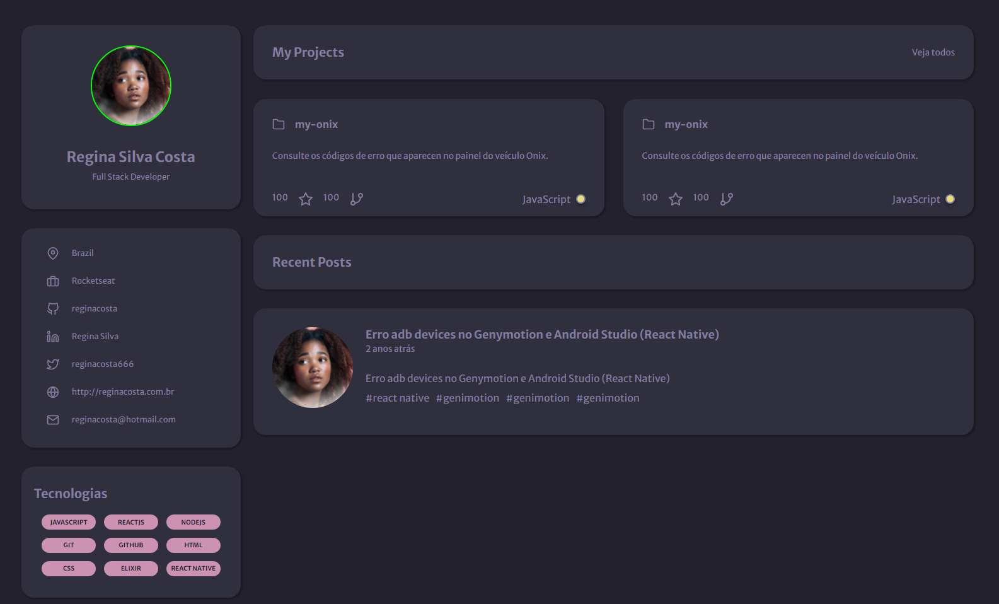

# Portfolio

  

##

### 🛠 Tecnologias

Foram usadas as tecnologias:

  - *HTML*
  - *CSS*
  - *JavaScript*

##

### 💻 Projeto

Neste desafio você poderá criar uma página web para que seja seu portfolio e currículo. Utilizando HTML e CSS.

Figma: https://www.figma.com/file/L6fCiWtOgXCfslQdezqQeF/DD-Portfolio/duplicate

#### Features:
<!-- ❌✅ -->

1. ❌ Os cards dos projetos deverão ser clicáveis.
2. ❌ Os cards dos posts deverão ser clicláveis.
3. ❌ Tornando o design responsivo.
4. ❌ Consumir a API do Github.

##

### 🚀 Deploy
https://rafaeljurkfitz.github.io/portfolio/
